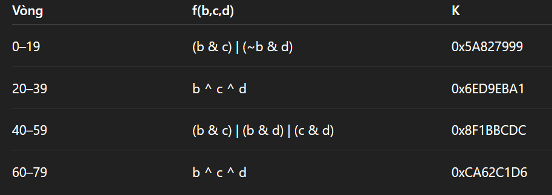
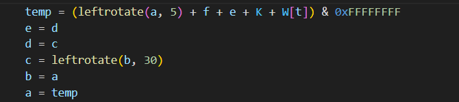

Đề yêu cầu viết đoạn code triển khai SHA-1 mà không dùng OPENSSL, library....

Cách hoạt động của SHA-1 :
1/ Tạo 1 key 16 bytes ngẫu nhiên 
2/ Tạo data bằng cách data= key||msg
3/ Padding thêm 1 byte 0x80 vào sau data, sau đso pad thêm các byte 0x00 vào sau sao cho độ dài = 56 mod 64 
4/ Padding thêm 8 bytes độ dài ban đầu dạng big Endian vào sau cùng ( 8 bytes = len ( key|| msg)*8 )
5/ Chia phần data sau khi được padding đủ thành các block 64 bytes, mỗi block chia thành các word (W) chứa 4 bytes ( mỗi block chia thành 16 W )
6/ Mở rộng từ 16 W thành 80 W bằng công thức "  W[i] = (leftrotate(W[i-3]^W[i-8]^W[i-14]^W[i-16],1)) " 
    leftrotate là hàm dịch xoay bit sang trái n bước 
7/ Với 5 hằng số SHA-1 :
    h0 = 0x67452301
    h1 = 0xEFCDAB89
    h2 = 0x98BADCFE
    h3 = 0x10325476
    h4 = 0xC3D2E1F0
nén 80 vòng lại:

các phép tính đều được mod 2^32 ( để duy trì độ dài 32 bit (& 0xFFFFFFFF))
8/ Cộng dồn vào kết quả tổng
9/ Xuất kết quả SHA-1 
    digest = h0 || h1 || h2 || h3 || h4 ( || là phép nối chuỗi )